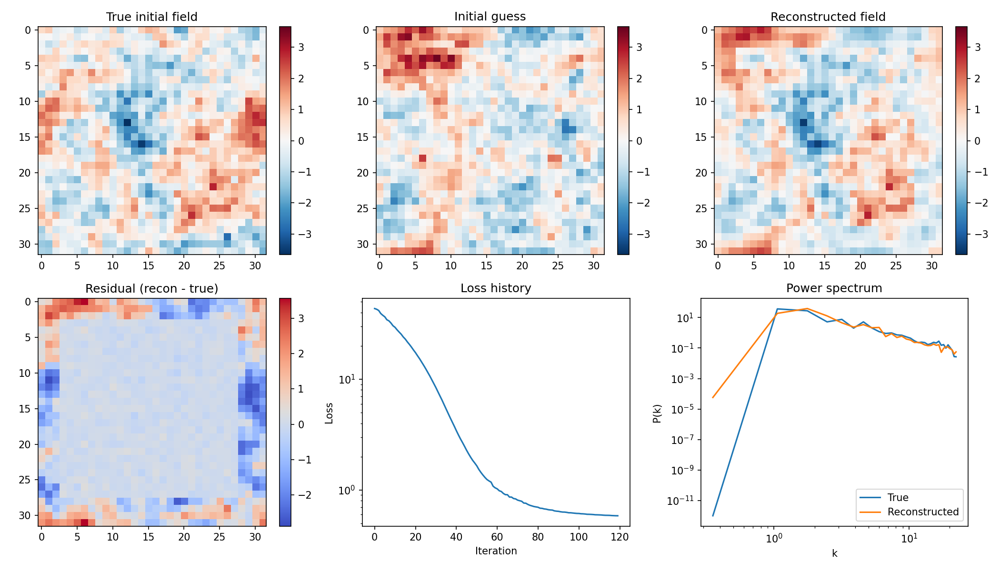

# Beginner Guide: What This Project Is, Why It Matters, and How It Works

This guide is written for people with little or no prior background in physics, mathematics, or data science.

For the full reading map, see `docs/index.md`.

If any term feels unfamiliar, use `docs/keywords.md` while reading this guide.

## One-Sentence Overview

We are building a system that tries to answer this question:

**"Given what the universe looks like now, what did it look like at the beginning?"**

## The Problem We Are Solving

Cosmology has two sides:

- **Forward problem**: start from early-universe conditions and simulate forward to today.
- **Inverse problem**: start from today’s observations and infer the early conditions.

The forward problem is relatively standard. The inverse problem is much harder.

This project focuses on the inverse problem.

## Why This Is Important

If we can reliably reconstruct the initial conditions, we can:

- understand structure formation better (voids, filaments, clusters)
- constrain cosmological models more directly at field level
- make better use of observational data than summary statistics alone
- connect physics simulation and modern machine learning workflows

## Big Idea: Differentiable Cosmology

A differentiable model means the whole pipeline is built so we can compute **gradients**.

Practical meaning:

- We can measure how a tiny change in the initial field changes final observations.
- We can use gradient-based optimization (like neural network training) to recover initial conditions.

So instead of guessing millions of initial fields blindly, we can move in the best direction using gradients.

## Conceptual Pipeline

```text
Initial Field (unknown) -> Forward Physics -> Observation Model -> Synthetic Observation
         ^                                                     |
         |-------------------- Gradient / Optimization --------|
```

```mermaid
flowchart LR
    A[Initial Field\nunknown] --> B[Forward Model\nPM-lite]
    B --> C[Observation Model\nmask + noise]
    C --> D[Observed Field]
    D --> E[Loss\n(data + prior)]
    E --> F[Gradients]
    F --> G[Optimizer]
    G --> A
```

In the current codebase, this is implemented as:

- `fields.py` -> generate initial Gaussian field
- `pm.py` -> evolve field with differentiable PM-lite dynamics
- `observe.py` -> apply mask and noise
- `loss.py` -> compare predicted observation with target + add prior
- `inference.py` -> optimize initial field (MAP)

## Essential Keywords (Quick Definitions)

- **Gradient**: tells us how the loss changes when the initial field changes.
- **Field-level inference**: reconstructing the whole grid/field, not just summary numbers.
- **MAP**: the single best reconstruction under prior + data constraints.
- **Prior**: what patterns are plausible before seeing the data.
- **Posterior**: updated belief after combining prior and observations.

For fuller definitions, see `docs/keywords.md`.

## Physics: What Is Being Modeled

This project currently uses a **2D toy universe**, not a full production 3D cosmology pipeline.

### 1. Initial fluctuations

The early universe is represented as a density fluctuation field. In Fourier space, its variance follows a power spectrum.

In code, we use a simple power-law form:

- `P(k) = A * k^n`

where:

- `k` = spatial frequency (large `k` means smaller scales)
- `A` = amplitude
- `n` = slope/index

### 2. Gravitational evolution (PM-lite)

We evolve the field using a particle-mesh style approximation:

- particles begin on a lattice
- density is deposited onto a grid (CIC)
- Poisson equation is solved in Fourier space
- forces are computed as gradients of potential
- particles are updated in small timesteps
- final density field is read back from particles

This gives a differentiable forward operator suitable for inverse inference.

### 3. Observation model

Real surveys are incomplete/noisy. We emulate this by:

- applying a rectangular mask
- adding Gaussian noise

So the model learns to reconstruct under imperfect observations.

## Mathematics: What Objective We Optimize

We frame reconstruction as MAP (Maximum A Posteriori) estimation.

### Posterior form

- `P(theta | y) ∝ P(y | theta) * P(theta)`

where:

- `theta` = initial field (unknown)
- `y` = observed field (known)

### Loss used in code

We minimize:

- data misfit term (how well prediction matches observation)
- prior term (spectral regularization from power spectrum)

Equivalent intuition:

- Fit the data
- Do not fit impossible or extremely unlikely initial fields

## Computer Science and Software Engineering Role

This project is not only physics. It is also a software system problem.

### Key engineering requirements

- differentiable numerical operators
- stable optimization (avoid NaNs/divergence)
- reproducibility (configs + seeds)
- automated tests
- modular architecture for future 3D extension

### Why JAX

JAX gives:

- autodiff
- fast array operations
- JIT compilation
- portable execution on CPU/GPU

### Current software architecture

- functional modules with explicit inputs/outputs
- minimal hidden state
- config-driven experiments (`data/toy/config.yaml`)
- script entrypoint (`scripts/run_toy_2d.py`)

## Data Science and Analysis Role

Data analysis is how we decide whether reconstruction is actually good.

### What we evaluate

- loss reduction during optimization
- cross-correlation between true and reconstructed initial fields
- power spectrum agreement
- numerical stability and finite gradients

### Why this matters

A model that runs is not enough. We need quantitative evidence that it reconstructs meaningful structure.

## Example Output (Visual)

The toy script generates a summary figure with:

- true initial field
- initial guess
- reconstructed field
- residual map
- loss curve
- power spectrum comparison

Example:



## What Has Been Completed (Current Snapshot)

Implemented and tested:

- 2D Gaussian initial field generator
- 2D PM-lite differentiable forward model
- mask + noise observation model
- MAP loss and optimizer loop
- end-to-end toy script with saved figures
- 20 passing tests (unit + smoke)

This is a working 2D research foundation.

## What Is Not Done Yet

Not yet production-ready cosmology:

- no full 3D production pipeline yet
- no realistic galaxy-halo observation model yet
- no posterior sampling workflow yet
- no large-scale distributed training/inference yet

## How to Run It

```bash
uv sync --active --extra dev
uv run --active pytest -q
uv run --active python scripts/run_toy_2d.py --profile default
```

You should get:

- saved outputs under `outputs/toy2d/`
- summary metrics including loss and cross-correlation

## Recommended Learning Path for Newcomers

1. Read this file once for the full picture.
2. Run `scripts/run_toy_2d.py` and inspect outputs.
3. Open `notebooks/00_toy_2d_forward.ipynb`.
4. Open `notebooks/01_toy_2d_inverse.ipynb`.
5. Skim `docs/keywords.md` any time a term is unclear.
6. Read `docs/overview.md` for deeper technical details.

## Project Vision

The long-term goal is a robust differentiable cosmology platform where:

- forward physics is realistic and scalable
- inverse reconstruction is reliable in high dimensions
- uncertainty is quantified with posterior methods
- analysis is reproducible and accessible to researchers and learners

This 2D MVP is the first engineering and scientific step toward that goal.
