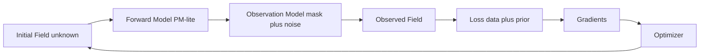

# Beginner Guide: What This Project Is, Why It Matters, and How It Works

This guide is written for people with little or no prior background in physics, mathematics, or data science.

For the full reading map, see `docs/index.md`.

If any term feels unfamiliar, use `docs/keywords.md` while reading this guide.

## One-Sentence Overview

We are building a system that tries to answer this question:

**"Given what the universe looks like now, what did it look like at the beginning?"**

## The Problem We Are Solving

Cosmology has two sides:

- **Forward problem**: start from early-universe conditions and simulate forward to today.
- **Inverse problem**: start from today’s observations and infer the early conditions.

The forward problem is relatively standard. The inverse problem is much harder.

This project focuses on the inverse problem.

## Why This Is Important

If we can reliably reconstruct the initial conditions, we can:

- understand structure formation better (voids, filaments, clusters)
- constrain cosmological models more directly at field level
- make better use of observational data than summary statistics alone
- connect physics simulation and modern machine learning workflows

## Big Idea: Differentiable Cosmology

A differentiable model means the whole pipeline is built so we can compute **gradients**.

Practical meaning:

- We can measure how a tiny change in the initial field changes final observations.
- We can use gradient-based optimization (like neural network training) to recover initial conditions.

So instead of guessing millions of initial fields blindly, we can move in the best direction using gradients.

## Conceptual Pipeline

```text
Initial Field (unknown) -> Forward Physics -> Observation Model -> Synthetic Observation
         ^                                                     |
         |-------------------- Gradient / Optimization --------|
```



In the current codebase, this is implemented as:

- `fields.py` -> generate initial Gaussian field
- `pm.py` -> evolve field with differentiable PM-lite dynamics
- `observe.py` -> apply mask and noise
- `loss.py` -> compare predicted observation with target + add prior
- `inference.py` -> optimize initial field (MAP)

## Essential Keywords (Quick Definitions)

- **Gradient**: tells us how the loss changes when the initial field changes.
- **Field-level inference**: reconstructing the whole grid/field, not just summary numbers.
- **MAP**: the single best reconstruction under prior + data constraints.
- **Prior**: what patterns are plausible before seeing the data.
- **Posterior**: updated belief after combining prior and observations.

For fuller definitions, see `docs/keywords.md`.

## Physics: What Is Being Modeled

This project currently uses a **2D toy universe**. That is intentional:
we start with a simplified but scientifically meaningful setup before moving to harder 3D realism.

### 1. What “matter field” means

We represent matter as a grid called a **density field**.
Each cell says whether that location is denser or less dense than average.

A common quantity is density contrast:

- `delta(x) = (rho(x) - rho_bar) / rho_bar`

Interpretation:

- `delta > 0`: overdense region (more matter than average)
- `delta < 0`: underdense region (less matter than average)

### 2. Why the power spectrum is used

Instead of describing a field only in position space, we also look at **Fourier space** (scales/frequencies).
The **power spectrum** tells us how much structure exists at each scale.

In this toy MVP we use:

- `P(k) = A * k^n`

where:

- `k` controls scale (small `k` = large structures, large `k` = small structures)
- `A` sets overall fluctuation strength
- `n` controls how fast power changes across scales

This is a simplified prior, but it captures the core idea that structure is scale-dependent.

### 3. How gravity evolution is approximated here (PM-lite)

The code uses a Particle-Mesh style approximation with differentiable operations:

1. Start particles on a regular lattice.
2. Convert particle positions to grid density using CIC (Cloud-In-Cell).
3. Solve for gravitational potential from density (Poisson equation in Fourier space).
4. Compute forces from potential gradients.
5. Move particles in small time steps.
6. Convert particle distribution back to a final density field.

Why this is physically useful:

- gravity causes matter to cluster over time
- PM captures large-scale clustering efficiently
- FFT-based force computation is much faster than direct pairwise gravity

### 4. What “observation model” means physically

Real measurements are never perfect. We mimic that with:

- a **mask** (parts of space are unseen)
- **noise** (measurement uncertainty)

So the model learns under realistic constraints, not only clean simulated truth.

### 5. What this toy model does and does not do

It does:

- capture core inverse-problem structure
- provide a gradient-friendly forward pipeline
- enable end-to-end reconstruction experiments

It does not yet:

- model full 3D cosmology
- include baryonic/hydrodynamic effects
- include full survey systematics

## Mathematics: What Objective We Optimize

We treat reconstruction as a Bayesian inverse problem and solve it with MAP.

### 1. Unknowns, knowns, and forward map

- `theta`: unknown initial field we want to recover
- `f(theta)`: forward physics simulator
- `y`: observed data

With noise and masking, conceptually:

- `y ≈ M(f(theta)) + epsilon`

where `M` is observation effects (mask/noise model), and `epsilon` is random noise.

### 2. Bayesian view

We want:

- `P(theta | y) ∝ P(y | theta) * P(theta)`

Meaning:

- `P(y | theta)` asks: does this candidate field explain observed data?
- `P(theta)` asks: is this candidate field physically plausible?

### 3. MAP objective used in practice

MAP finds one best field (not the full uncertainty distribution) by minimizing:

- data term + prior term

In code-level form:

- `L(theta) = data_misfit(theta) + lambda * prior_penalty(theta)`

Intuition:

- data term: punish disagreement with observed field
- prior term: punish unrealistic spectral content
- `lambda`: trade-off knob between fitting data and staying plausible

### 4. What the gradient means mathematically

The gradient `dL/dtheta` tells us, for every cell in the initial field:

- if we nudge this cell up/down, does the total loss improve?

Then optimization repeats:

1. compute gradient
2. update `theta`
3. recompute loss
4. continue until improvement stalls

### 5. Why this is better than naive guessing

Naive search in high dimensions is expensive.
Gradient information gives directed updates, which is why this approach is computationally practical.

## Computer Science and Software Engineering Role

Physics alone is not enough. This is also a numerical software engineering problem.

### 1. Why implementation quality matters

Even correct equations can fail in code if:

- gradients explode or become NaN
- optimization diverges
- experiments are not reproducible
- module boundaries are unclear

So the project must be engineered for stability and repeatability, not only correctness on paper.

### 2. Why JAX is a strong fit

JAX provides:

- automatic differentiation through simulation code
- vectorized, efficient array operations
- optional JIT compilation for speed
- CPU/GPU portability with minimal code changes

That makes it practical to combine physics simulation and gradient-based inference in one stack.

### 3. How the repository is structured as a system

- `fields.py`: initial condition generation
- `pm.py`: forward dynamics
- `observe.py`: measurement effects
- `loss.py`: objective function
- `inference.py`: optimizer loop
- `utils.py`: shared analysis/spectral tools

This modular design keeps responsibilities clear and helps future 3D extension.

### 4. Reliability features already in the code

The implementation includes practical safeguards such as:

- gradient clipping
- backtracking step-size control
- early stopping
- finite-value checks
- deterministic seeds/config-driven runs

These are standard numerical engineering tools to keep optimization stable.

### 5. Why tests are central (not optional)

Automated tests verify:

- math kernels behave as expected
- gradients are finite
- reconstruction loop improves objective
- end-to-end pipeline actually runs

This reduces regressions as the codebase grows.

## Data Science and Analysis Role

Data analysis is how we decide whether reconstruction is actually good.

### What we evaluate

- loss reduction during optimization
- cross-correlation between true and reconstructed initial fields
- power spectrum agreement
- numerical stability and finite gradients

### Why this matters

A model that runs is not enough. We need quantitative evidence that it reconstructs meaningful structure.

## Example Output (Visual)

The toy script generates a summary figure with:

- true initial field
- initial guess
- reconstructed field
- residual map
- loss curve
- power spectrum comparison

Example:


## What Has Been Completed (Current Snapshot)

Implemented and tested:

- 2D Gaussian initial field generator
- 2D PM-lite differentiable forward model
- mask + noise observation model
- MAP loss and optimizer loop
- end-to-end toy script with saved figures
- 20 passing tests (unit + smoke)

This is a working 2D research foundation.

## What Is Not Done Yet

Not yet production-ready cosmology:

- no full 3D production pipeline yet
- no realistic galaxy-halo observation model yet
- no posterior sampling workflow yet
- no large-scale distributed training/inference yet

## How to Run It

```bash
uv sync --active --extra dev
uv run --active pytest -q
uv run --active python scripts/run_toy_2d.py --profile default
```

You should get:

- saved outputs under `outputs/toy2d/`
- summary metrics including loss and cross-correlation

## Recommended Learning Path for Newcomers

1. Read this file once for the full picture.
2. Run `scripts/run_toy_2d.py` and inspect outputs.
3. Open `notebooks/00_toy_2d_forward.ipynb`.
4. Open `notebooks/01_toy_2d_inverse.ipynb`.
5. Skim `docs/keywords.md` any time a term is unclear.
6. Read `docs/overview.md` for deeper technical details.

## Project Vision

The long-term goal is a robust differentiable cosmology platform where:

- forward physics is realistic and scalable
- inverse reconstruction is reliable in high dimensions
- uncertainty is quantified with posterior methods
- analysis is reproducible and accessible to researchers and learners

This 2D MVP is the first engineering and scientific step toward that goal.
